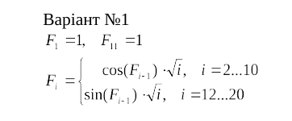
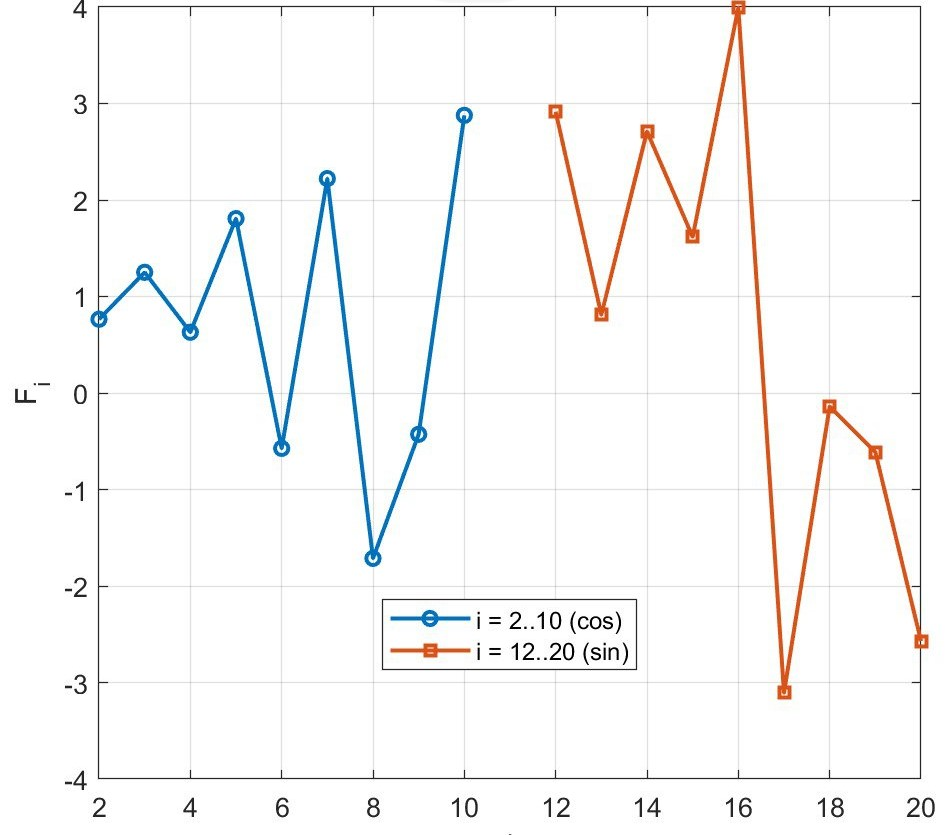
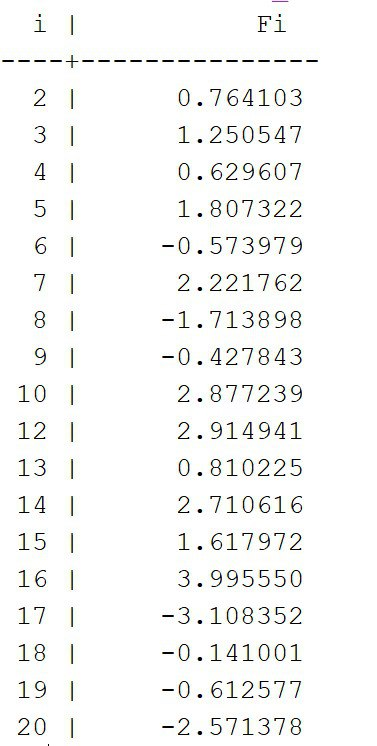

<p align="center"><b>МОНУ НТУУ КПІ ім. Ігоря Сікорського ФПМ СПіСКС</b></p>
<p align="center">
<b>Звіт з розрахунково-графічної роботи</b>
<br/><br/>
з дисципліни <br/> "Вступ до функціонального програмування"
</p>
<p align="right"><b>Студентка</b>: <Бондарева Валерія Романівна> КВ-22</p>
<p align="right"><b>Рік</b>: 2025</p>

## Загальне завдання
    1. Реалізувати програму для обчислення функції згідно варіанту мовою Common Lisp
    2. Виконати тестування реалізованої програми
    3. Порівняти результати роботи програми мовою Common Lisp з розрахунками іншими засобами

## Варіант завдання №1

<p align="center">
  
</p>


## Лістинг реалізації обчислення функції
```lisp
(defun fi (i)
  (labels ((f (k)
             (cond ((= k 1) 1d0)
                   ((= k 11) 1d0)
                   ((and (>= k 2) (<= k 10)) (* (cos (f (1- k))) (sqrt k)))
                   ((and (>= k 12) (<= k 20)) (* (sin (f (1- k))) (sqrt k)))
                   (t (error "i out of range: ~A" k)))))
    (f i)))
```
### Тестові набори та утиліти
```lisp
(defun table-rec ()
  (append
   (loop for i from 2 to 10 collect (cons i (fi i)))
   (loop for i from 12 to 20 collect (cons i (fi i)))))

(defun table-iter ()
  (let ((res '()) (p 1d0))
    (loop for i from 2 to 10 do
          (setf p (* (cos p) (sqrt i)))
          (push (cons i p) res))
    (setf p 1d0)
    (loop for i from 12 to 20 do
          (setf p (* (sin p) (sqrt i)))
          (push (cons i p) res))
    (nreverse res)))

(defun print-fi-table (&optional (pairs (table-iter)))
  (format t "~&  i |       Fi~%")
  (format t "----+--------------~%")
  (dolist (p pairs)
    (format t "~3D | ~,5,2E~%" (car p) (cdr p)))
  (values))

(defun run-checks ()
  (labels ((abs<= (x b) (<= (abs x) (+ b 1d-12))))
    (let* ((tbl (table-iter))
           (equal-p (equal (mapcar #'cdr tbl) (mapcar #'cdr (table-rec))))
           (ok1 (= (fi 1) 1d0))
           (ok11 (= (fi 11) 1d0))
           (bounds-up   (every #'identity
                               (mapcar (lambda (pr) (abs<= (cdr pr) (sqrt (car pr))))
                                       (remove-if-not (lambda (pr) (<= 2 (car pr) 10)) tbl))))
           (bounds-down (every #'identity
                               (mapcar (lambda (pr) (abs<= (cdr pr) (sqrt (car pr))))
                                       (remove-if-not (lambda (pr) (<= 12 (car pr) 20)) tbl)))))
      (format t "~&[TEST] F1=1: ~A~%" ok1)
      (format t "[TEST] F11=1: ~A~%" ok11)
      (format t "[TEST] rec==iter tables: ~A~%" equal-p)
      (format t "[TEST] |Fi| for 2..10: ~A~%" bounds-up)
      (format t "[TEST] |Fi| for 12..20: ~A~%" bounds-down)
      (values))))
```
### Тестування
```lisp
CL-USER> (print-fi-table)
  i |       Fi
----+--------------
  2 | 7.64103d-01
  3 | 1.25055d+00
  4 | 6.29607d-01
  5 | 1.80732d+00
  6 | -5.73979d-01
  7 | 2.22176d+00
  8 | -1.71390d+00
  9 | -4.27842d-01
 10 | 2.87724d+00
 12 | 2.91494d+00
 13 | 8.10226d-01
 14 | 2.71062d+00
 15 | 1.61797d+00
 16 | 3.99555d+00
 17 | -3.10835d+00
 18 | -1.40998d-01
 19 | -6.12561d-01
 20 | -2.57132d+00
; No value
CL-USER> (run-checks)
[TEST] F1=1: T
[TEST] F11=1: T
[TEST] rec==iter tables: T
[TEST] |Fi| for 2..10: T
[TEST] |Fi| for 12..20: T
; No value;
```

### Порівняння результатів з іншими методами (Matlab)
<p align="center">
  
  <br>Графік
</p>

<p align="center">
  
  <br>Таблиця
</p>

